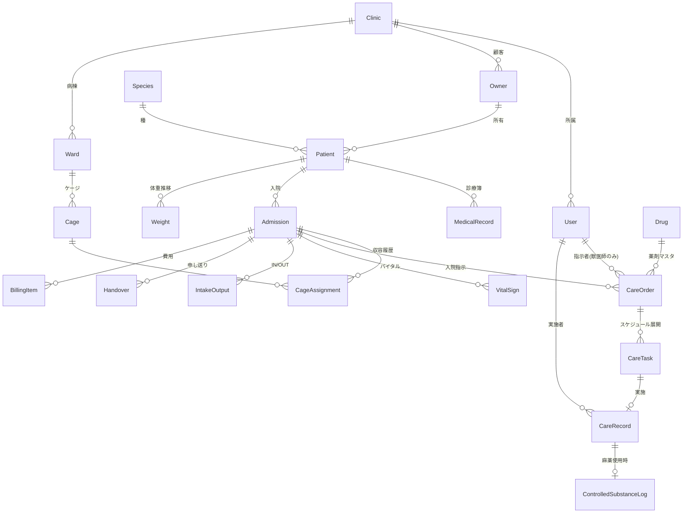
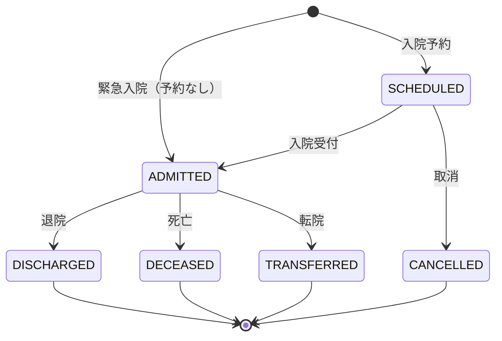
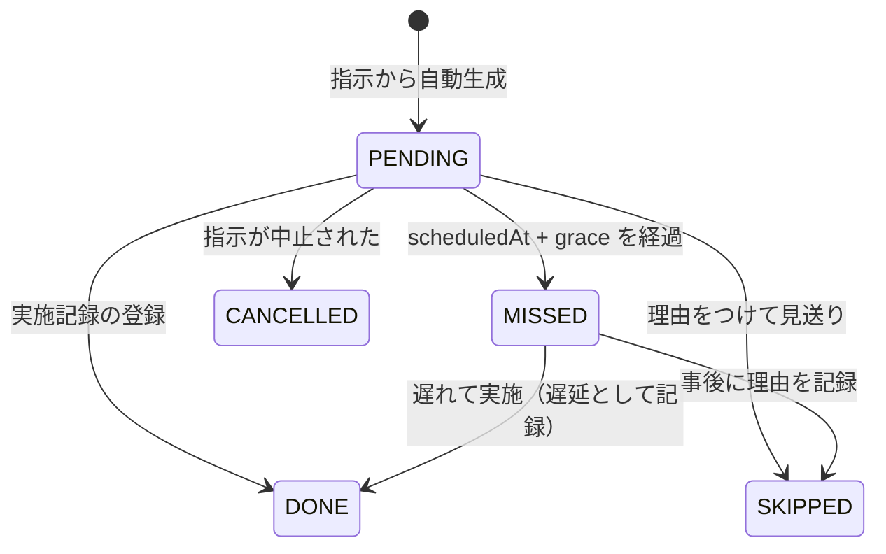

# 03. ドメインモデル

用語は `01-glossary.md`、制約の根拠は `02-regulatory-requirements.md` を参照。

---

## 1. 集約の全体像



境界づけられたコンテキストは 3 つに分ける。

| コンテキスト | 責務 | Phase |
|---|---|---|
| **入院ケア** (Inpatient Care) | Admission / CareOrder / CareTask / CareRecord / VitalSign / Handover | 1 |
| **診療録** (Medical Record) | Patient / Owner / MedicalRecord / Weight | 1（最小） |
| **費用** (Billing) | BillingItem とエクスポート | 1（出力のみ） |

---

## 2. 中核集約: Admission（入院）

### 2.1 属性

| 属性 | 型 | 必須 | 説明 |
|---|---|---|---|
| `id` | UUID | ○ | |
| `clinicId` | UUID | ○ | テナント。RLS のキー |
| `admissionNo` | string | ○ | 病院内で一意。表示用 |
| `patientId` | UUID | ○ | |
| `attendingVeterinarianId` | UUID | ○ | 主治医。交代時は履歴に残す |
| `status` | enum | ○ | 下記状態遷移を参照 |
| `scheduledAt` | timestamptz | | 入院予定日時 |
| `admittedAt` | timestamptz | | 実入院日時 |
| `dischargedAt` | timestamptz | | 退院日時 |
| `chiefComplaint` | text | ○ | 主訴 |
| `ownerStatement` | text | | りん告（法定記載事項の引き継ぎ） |
| `provisionalDiagnosis` | text | | 病名 |
| `careLevel` | enum | ○ | `GENERAL` / `ICU` / `ISOLATION` |
| `isolationReason` | text | | 隔離時は必須 |
| `dnrOrder` | boolean | ○ | 蘇生処置に関する飼育者の意思。**入院時に必ず確認する** |
| `emergencyContact` | text | ○ | 夜間急変時の連絡先 |
| `contactPolicy` | enum | ○ | 夜間の連絡可否（`ANYTIME` / `DAYTIME_ONLY` / `NO_CALL`） |

> `dnrOrder` と `contactPolicy` を必須にしているのは、夜間の急変時に「飼い主に連絡してよいか」「どこまで処置するか」が分からず現場が止まるのが、入院管理の実務で最も深刻な事故要因だから。紙の運用では入院同意書の隅に書かれて埋もれる。**ここを構造化するのは製品価値そのもの。**

### 2.2 状態遷移



**不変条件**
1. `ADMITTED` に遷移するには、有効な `CageAssignment` が1件存在すること。
2. 終了状態（`DISCHARGED` / `DECEASED` / `TRANSFERRED`）に遷移するとき、`status = ACTIVE` の `CareOrder` が残っていてはならない。すべて `COMPLETED` か `DISCONTINUED` にする。
   → 「退院したのに点滴の指示が生きている」を防ぐ。
3. 終了状態から他の状態には戻せない。誤操作時は取消理由を記録した上で管理者のみが復帰させ、監査ログに残す。
4. `careLevel = ISOLATION` のとき `isolationReason` は必須。かつ隔離病棟の `Cage` にのみ割当可能。

---

## 3. 指示・タスク・実施の3層

### 3.1 CareOrder（入院指示）

| 属性 | 型 | 説明 |
|---|---|---|
| `id` | UUID | |
| `admissionId` | UUID | |
| `type` | enum | `MEDICATION` / `FLUID` / `PROCEDURE` / `LAB` / `FEEDING` / `OBSERVATION` / `ACTIVITY` |
| `orderedById` | UUID | **獣医師ロールのみ。DB制約でも担保する** |
| `enteredById` | UUID | 代理入力者。口頭指示の場合に使う |
| `isVerbalOrder` | boolean | 口頭指示フラグ |
| `verbalOrderApprovedAt` | timestamptz | 獣医師の後追い承認。null なら未承認 |
| `status` | enum | `DRAFT` / `ACTIVE` / `SUSPENDED` / `DISCONTINUED` / `COMPLETED` |
| `startAt` / `endAt` | timestamptz | 有効期間 |
| `schedule` | jsonb | 頻度定義（下記） |
| `isPrn` | boolean | 頓用か |
| `prnCondition` | text | 頓用の実施条件（`isPrn` のとき必須） |
| `requiredQualification` | enum | `NONE` / `NURSE` / `VETERINARIAN` |
| `instruction` | text | 自由記述の指示内容 |
| `version` | int | 変更のたびに増やす |
| `supersedesId` | UUID | 変更前の指示。**更新でなく新レコード** |

**投薬・輸液の場合の追加属性**

| 属性 | 型 | 説明 |
|---|---|---|
| `drugId` | UUID | 薬剤マスタ |
| `dosePerKg` | numeric | mg/kg |
| `referencedWeightId` | UUID | **計算に使った体重の実測レコード** |
| `calculatedTotalDose` | numeric | mg |
| `calculatedVolume` | numeric | mL |
| `route` | enum | IV / IM / SC / PO / IO / PR |
| `infusionRate` | numeric | mL/hr（CRI の場合） |

**不変条件**
1. `orderedById` のユーザーは `Veterinarian` ロールであること（獣医師法第18条）。
2. `status` が `ACTIVE` になった `CareOrder` は**属性を書き換えてはならない**。変更は必ず新バージョンを作り、旧レコードを `DISCONTINUED` にして `supersedesId` で繋ぐ。
3. `isVerbalOrder = true` かつ `verbalOrderApprovedAt IS NULL` の指示は、ケージボード上で常時警告表示する。承認期限（既定24時間）を過ぎたらエスカレーション。
4. `requiredQualification` は `type` から既定値が決まるが、病院ごとに上書き可能。

### 3.2 schedule の表現

```jsonc
// 8時間毎（1日3回、8:00/16:00/24:00）
{ "kind": "interval", "everyHours": 8, "anchorTime": "08:00" }

// 指定時刻（1日2回）
{ "kind": "times", "times": ["09:00", "21:00"] }

// 持続（CRI・輸液）— タスクは展開せず、定時の確認タスクのみ生成
{ "kind": "continuous", "checkEveryHours": 4 }

// 単回
{ "kind": "once", "at": "2026-07-31T14:00:00+09:00" }
```

`kind: "continuous"` を別扱いにするのが重要。輸液は「実施する」のではなく「流れ続けているのを確認する」ものなので、投薬と同じタスクモデルに押し込めると現場と合わなくなる。

### 3.3 CareTask（ケアタスク）

指示から生成される個々の予定。**生成はサーバ側のジョブが担当し、手で作らせない。**

| 属性 | 型 | 説明 |
|---|---|---|
| `id` | UUID | |
| `careOrderId` | UUID | |
| `scheduledAt` | timestamptz | |
| `graceMinutes` | int | 許容幅（既定30分、病院設定） |
| `status` | enum | `PENDING` / `DONE` / `SKIPPED` / `MISSED` / `CANCELLED` |

**状態遷移**



**不変条件**
1. `MISSED` への遷移は時刻経過による自動遷移のみ。人間が直接指定できない。
2. `SKIPPED` には理由（`skipReason`）が必須。
3. `MISSED` → `DONE` の場合、`CareRecord.isDelayed = true` を立て、遅延時間を保持する。**遅延を隠せる設計にしない。**

### 3.4 CareRecord（実施記録）

| 属性 | 型 | 説明 |
|---|---|---|
| `id` | UUID | |
| `careTaskId` | UUID | 頓用・臨時実施では null 可 |
| `admissionId` | UUID | 常に必須（タスク無しでも入院には紐づく） |
| `performedById` | UUID | 実施者 |
| `performedAt` | timestamptz | 実施時刻。入力時刻とは別 |
| `recordedAt` | timestamptz | システムへの入力時刻 |
| `actualDose` / `actualVolume` | numeric | 実投与量。指示と違う場合は理由必須 |
| `deviationReason` | text | 指示と実績が乖離した理由 |
| `isDelayed` | boolean | |
| `note` | text | |
| `witnessedById` | UUID | 立会者（麻薬・高リスク薬で必須） |

**不変条件**
1. **`CareRecord` は append-only。UPDATE / DELETE を許可しない。** 訂正は `CareRecordAmendment`（訂正レコード）を追加し、元レコードは残す。訂正には理由が必須。
2. `performedById` のロールが `CareOrder.requiredQualification` を満たすこと（愛玩動物看護師法）。サーバ側で検証し、クライアントの判定を信用しない。
3. `performedAt` は未来時刻を許さない。また入院期間外も許さない。
4. `actualDose` が指示値と異なる場合、`deviationReason` は必須。

---

## 4. 投与量計算

**計算は必ずサーバ側で行い、クライアントの計算結果は保存しない。** 表示のためのクライアント計算は許すが、保存値はサーバで再計算した値のみ。

### 4.1 式

```
totalDose(mg)        = dosePerKg(mg/kg) × weight(kg)
volumeToAdminister(mL) = totalDose(mg) ÷ concentration(mg/mL)

CRI:
infusionRate(mL/hr)  = ( dosePerKgPerHour(mg/kg/hr) × weight(kg) ) ÷ concentration(mg/mL)

希釈した場合:
concentration(mg/mL) = 薬液量(mg) ÷ 希釈後総量(mL)
```

### 4.2 丸めと単位

- 内部計算はすべて `numeric`（浮動小数点を使わない）。金額と同じ扱い。
- 表示上の丸めは**投与直前の1回だけ**。中間結果を丸めて次の計算に渡さない。
- 有効数字は薬剤マスタの `displayPrecision` に従う（既定: 小数第2位）。
- 単位は必ず値とセットで持つ（`{ value, unit }`）。裸の数値を渡さない。

### 4.3 安全チェック

| チェック | 挙動 |
|---|---|
| `dosePerKg > drug.maxDosePerKg` | **保存を阻止**。獣医師の明示的な上書き（理由入力）でのみ通す |
| 種別禁忌（例: 猫にアセトアミノフェン） | **保存を阻止**。上書き不可 |
| 体重が30日以上前の測定値 | 警告表示。再測定を促す |
| 指示作成時の体重と現在の体重が10%以上乖離 | 警告表示、再計算を促す |
| 投与容量が 0.05mL 未満 / 20mL 超（小動物） | 警告表示。希釈または分割を促す |

> 警告は「診断」ではなく「入力値の範囲チェック」として実装し、UI文言も「上限を超えています」に留める。「危険」「禁忌の疑い」等の評価語は使わない（`02-regulatory-requirements.md` §6）。

---

## 5. 記録系エンティティ

### VitalSign

```
id, admissionId, measuredAt, measuredById,
bodyTemperature(℃), heartRate(bpm), respiratoryRate(/min),
systolicBP, diastolicBP, meanBP (mmHg), spo2(%),
crt(sec), mucousMembraneColor(enum), consciousnessLevel(enum),
painScore(int), painScaleUsed(string), note
```

- 全項目が任意。**1項目だけの記録を許す**（体温だけ測る場面が非常に多い）。必須にすると現場が入力を諦める。
- 基準値レンジは `Species` × 年齢帯のマスタに持ち、範囲外は色で表示するのみ。

### IntakeOutput

```
id, admissionId, recordedAt, recordedById,
waterIntake(mL), foodOffered(g), foodConsumed(g), foodType,
urineOutput(mL), urinationCount, urineNote,
defecationCount, fecalScore, vomitingCount, vomitusNote
```

- 給餌量（`foodOffered`）と摂取量（`foodConsumed`）を必ず分ける。食欲は最重要の観察項目で、「出したが食べなかった」が臨床的に意味を持つ。

### Weight

```
id, patientId, measuredAt, measuredById, weightKg, note
```

- `Patient` に現在体重を持たせない。常に最新の `Weight` を参照する。
- `CareOrder` は計算に使った `Weight.id` を保持する（トレーサビリティ）。

### Handover（申し送り）

```
id, admissionId(nullable), clinicId, fromShiftId, toShiftId,
authoredById, content, priority(enum), createdAt
HandoverAck: handoverId, acknowledgedById, acknowledgedAt
```

- `admissionId` が null のときは病院全体への申し送り。
- **既読管理（`HandoverAck`）を必須にする。** 「言った/聞いてない」が事故の温床なので、受け取り確認を残すこと自体が価値。

### ControlledSubstanceLog（麻薬・向精神薬）

```
id, clinicId, careRecordId, drugId, administeredById(獣医師),
witnessedById, amountUsed, amountWasted, wastageWitnessedById,
stockBefore, stockAfter, recordedAt
```

- `amountWasted`（端数廃棄）に立会者を必須にする。
- 残量（`stockAfter`）が計算値と合わないときは締め処理を通さない。

### AuditLog

```
id, clinicId, actorId, action, entityType, entityId,
before(jsonb), after(jsonb), ipAddress, userAgent, occurredAt
```

- 全書き込み操作を記録。**このテーブルへの UPDATE / DELETE はアプリ用DBロールに与えない。**

---

## 6. 記録の不変性（電子保存の三原則への対応）

法定記録に関わるテーブルは以下の方針で扱う。

| テーブル | 変更方針 |
|---|---|
| `CareRecord` / `VitalSign` / `IntakeOutput` / `MedicalRecord` / `ControlledSubstanceLog` | **append-only**。訂正は `*Amendment` レコードの追加。物理削除しない |
| `CareOrder` | ACTIVE 後は不変。変更は新バージョン + `supersedesId` |
| `Admission` / `CageAssignment` | 状態遷移のみ許可。遷移は履歴テーブルに残す |
| マスタ（`Drug` / `Species` / `Cage`） | 通常の更新可。ただし論理削除のみ（過去の記録が参照するため） |

実装レベルでは、アプリケーションが使う DB ロールから該当テーブルの `UPDATE` / `DELETE` 権限を剥奪し、**アプリのバグでは消せない**状態にする。

---

## 7. マルチテナント分離

- 全テーブルに `clinic_id` を持つ。
- PostgreSQL の **Row Level Security** を有効化し、セッション変数 `app.current_clinic_id` に基づくポリシーで絞る。
- アプリ層の `WHERE clinic_id = ?` は「二重の防御」であって、それだけに依存しない。
- マイグレーションで新テーブルを作るとき RLS 有効化を強制する CI チェックを入れる。

---

## 8. まだ決めていないこと

- `MedicalRecord`（外来カルテ）をどこまで持つか。既存レセコンと二重入力になる領域なので、`00-scope-and-principles.md` の方針次第。
- 費用の積み上げ単位（実施記録ごとか、指示ごとか、日次か）。病院の会計慣行を実地調査してから決める。
- 詳細は `06-open-questions.md`。
